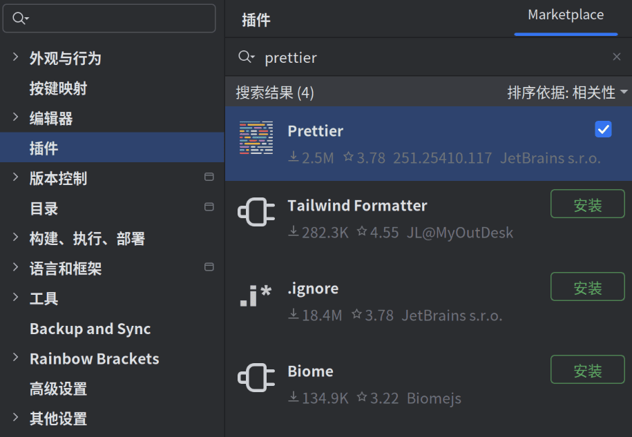
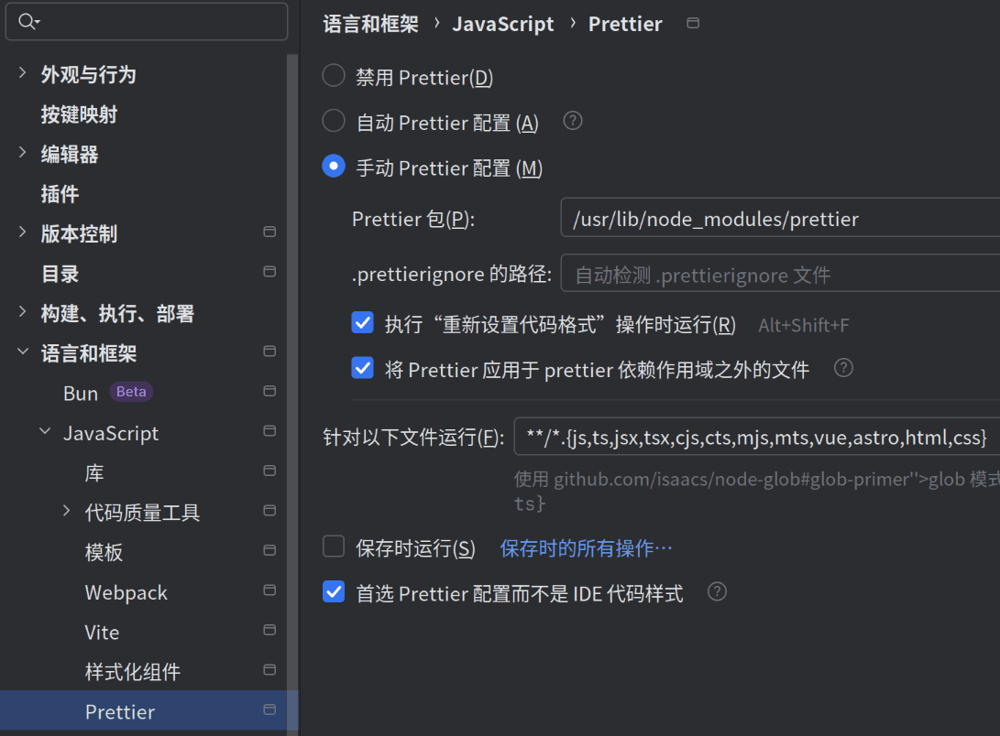
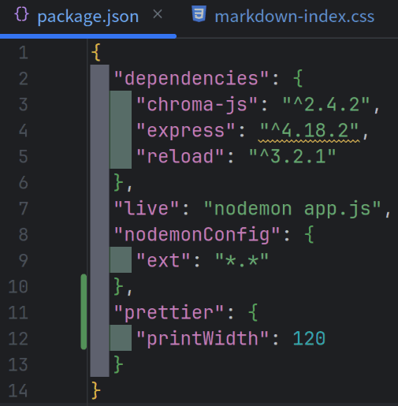

# <center>使用 **Prettier**</center>

## 下载 **Prettier**

通过 `npm` 进行下载：

```bash
npm install -g prettier
```

命令下载，`-g` 代表全局有效。下载完成后，运行以下代码：
```bash
prettier --version
```
出现版本号，说明安装成功：


## 安装 `Prettier` 插件

访问设置中的 `插件` 选项卡，搜索 `Prettier`，安装该插件：



安装完成后可能需要重启**IDE**。

## 配置 `Prettier` 插件

依次访问：`设置` → `语言和框架` → `JavaScript` → `Prettier`：



设置可根据个人需要勾选。我选中了 `执行 “重新设置代码格式” 操作时运行`，取消了 `保存时运行`，并且在 `针对以下文件运行`
中添加了 `html` 和 `css`，这是我的个人习惯。

## 设置 `Prettier` 最大宽度

`Prettier` 默认行宽度为 `80`，也就是说，一行超过**80**个字符，格式化时就会强制换行。更改这个数值有几种方法：

- 项目根目录有 `package.json`

  参考 `11 - 13` 行进行配置：

  