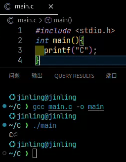

# <center>使用 `GCC`</center>

## 下载 `GCC`

- 和 Windows 相比，在 Linux 系统上装 `GCC` 要容易一些
- 在终端输入如下代码

  ```
  sudo apt install gcc
  ```


## 检查 `GCC` 安装

- `GCC` 装完后可以通过以下命令检查是否安装成功
- 在终端输入如下代码

  ```
  gcc --version
  ```


- 如果出现出现错误信息，说明 `GCC` 没有安装成功

## 使用 `GCC` 编译

- 可以在 VScode 中新建.c 源文件，用 `GCC` 进行编译

  ```
  gcc main.c -o main
  ```



- 或者在终端里用 vim 编写源文件，再用 `GCC` 进行编译


- 但是这边请确保源文件位于当前工作目录，以避免路径错误。
